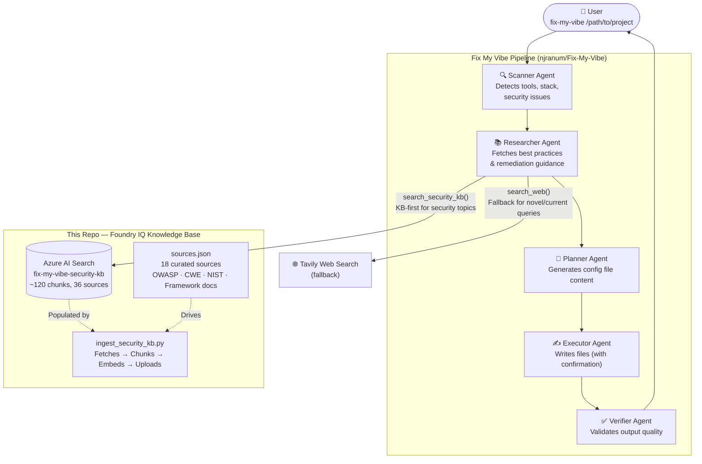

# Fix My Vibe — Foundry IQ Knowledge Base

> Azure AI Search knowledge base powering the Researcher agent in [Fix My Vibe](https://github.com/njranum/Fix-My-Vibe)

This repo builds and maintains the curated security knowledge base that the Fix My Vibe Researcher agent queries instead of relying on web search alone. It ingests authoritative sources (OWASP, CWE, NIST, framework docs) into an Azure AI Search index, giving the agent grounded, citable, low-latency answers for known security patterns.

---

## How it fits into Fix My Vibe



---

## What's in the index

| Category | Sources | OWASP Mapping |
|---|---|---|
| SQL Injection | CWE-89, OWASP A05 Cheat Sheet | A03 |
| Hardcoded Secrets | OWASP Secrets Mgmt Cheat Sheet, CWE-798 | A07 |
| Weak Cryptography | OWASP A04, NIST SP 800-57, Python `cryptography` docs | A02 |
| Code Injection / eval | CWE-94, OWASP Input Validation Cheat Sheet | A03 |
| Debug & Logging Leaks | OWASP A09, OWASP Logging Cheat Sheet, OWASP Error Handling | A09 |
| Misconfiguration | Django Security Docs, Express Best Practices, FastAPI Security | A05 |
| AI Tool Config Hygiene | Claude Code, Cursor, Copilot, Windsurf, Aider docs | — |

**Stack coverage:** Python, FastAPI, JavaScript, Node.js, React, Django, Express, Flask

---

## How the Researcher agent uses it

The Researcher agent in Fix My Vibe registers `search_security_kb` as its primary tool alongside Tavily web search. When the Scanner finds a security issue, the Researcher queries the KB first:

```
[KB] search_security_kb query='SQL injection parameterized queries FastAPI' stack=python threat=injection
[KB] → 5 results: [CWE-89: SQL Injection], [FastAPI Security Documentation], ...

[KB] search_security_kb query='hardcoded secret detection and mitigation' threat=secrets
[KB] → 5 results: [OWASP - Secrets Management Cheat Sheet], ...
```

The agent cites KB sources in its output (`knowledge_sources_used`) and falls back to Tavily only when the KB returns no results for a query.

---

## Setup

### Prerequisites

```bash
pip install azure-search-documents azure-identity openai requests
```

### Credentials

Copy to `.env` and fill in your Azure values:

```bash
AZURE_SEARCH_ENDPOINT=https://your-search.search.windows.net
AZURE_SEARCH_KEY=your-search-key
AZURE_OPENAI_ENDPOINT=https://your-openai.openai.azure.com/
AZURE_OPENAI_KEY=your-openai-key
AZURE_OPENAI_EMBEDDING_MODEL=text-embedding-3-small
```

### Run ingestion

```bash
python kb/ingest_security_kb.py --sources kb/sources.json --config kb/kb_config.json
```

Takes 2–3 minutes. Expects output: `✅ Ingestion complete!`

### Validate

```bash
python -c "
from azure.search.documents import SearchClient
from azure.core.credentials import AzureKeyCredential
import os
client = SearchClient(os.environ['AZURE_SEARCH_ENDPOINT'], 'fix-my-vibe-security-kb', AzureKeyCredential(os.environ['AZURE_SEARCH_KEY']))
print(f'Chunks indexed: {client.get_document_count()}')
"
```

---

## Files

| File | Purpose |
|---|---|
| `kb/sources.json` | 18 curated sources with threat categories, OWASP mappings, stack tags |
| `kb/kb_config.json` | Azure AI Search index schema, embedding config, chunking parameters |
| `kb/ingest_security_kb.py` | Ingestion script: fetch → chunk → embed → upload |
| `kb/RESEARCHER_INTEGRATION.md` | How `search_security_kb` is wired into the Researcher agent |
| `kb/README.md` | KB-specific quick start |

---

## Maintenance

The index should be refreshed quarterly or when OWASP/CWE publish new versions (typically January). Re-running the ingestion script recreates the index:

```bash
python kb/ingest_security_kb.py --sources kb/sources.json --config kb/kb_config.json
```

---

## Part of Fix My Vibe

This repo is the knowledge layer only. The main application — CLI, agents, and Foundry integration — lives at [njranum/Fix-My-Vibe](https://github.com/njranum/Fix-My-Vibe).
